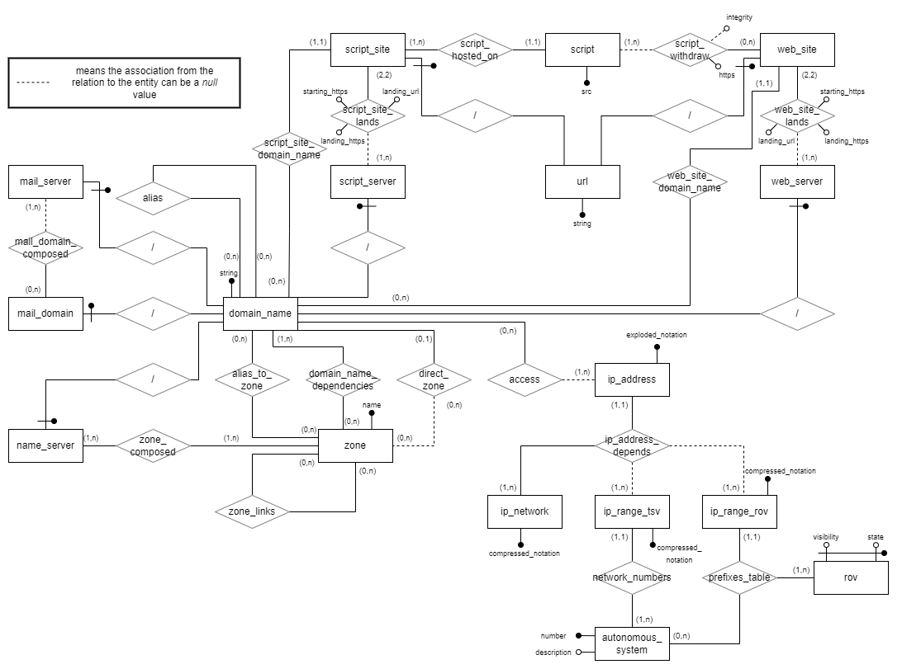

# LavoroTesi

This software takes a list of web pages and a list of mail domains as input and collects all architectural dependencies of those inputs in terms of zones, nameservers, IP networks, autonomous systems.

The framework for describing dependencies is described in detail in:

> Alberto Bartoli,
 Robustness analysis of DNS paths and web access paths in public administration websites,
 Computer Communications,
 Volume 180, 2021, Pages 243-258,
 https://doi.org/10.1016/j.comcom.2021.09.017.
 https://www.sciencedirect.com/science/article/pii/S0140366421003546

## Configuration 
Python version: 3.8
Package manager (pip) version: 21.2.2

Python modules:
```
pip install dnspython==2.1.0
pip install selenium==4.1.0
pip install selenium-wire==4.5.5
pip install peewee==3.14.8
```
Other Python modules used:
```
dns
csv
pathlib
re
urllib
ipaddress
requests
gzip
```
Install Firefox, download geckodriver (https://github.com/mozilla/geckodriver/releases) and put the executable file in the input folder (see below).

Developed on Windows 10.

## Usage

### Input folder
Directory named `input` in the project root directory (PRD). This directory should contain:

1) the geckodriver executable file (not the archive); more specifically the application will search for a file named
`geckodriver.exe` in the `input` folder.
2) a `.tsv` file describing the association between network ranges and autonomous systems. If no `tsv` file is found in
this folder, then it will be downloaded from https://iptoasn.com/ (see that web site for a description of the format of
this file).
3) a text file `web_pages.txt` containing all the website HTTP URLs you want to use as input, one per line (if this file
is not present then a default content hardwired in the code will be used); application will handle even if URLs don't
contain protocol.
4) a text file `mail_domains.txt` with one mail domain in each line (if this file is not present then a default content
hardwired in the code will be used)

If the `output` folder contains a text file `dns_cache.csv` (produced by a previous execution of the tool) then the
content of this file will be used for initializing the DNS cache of the DNS resolver module. Otherwise, the DNS cache
will be initialand the RR containing in it will not be queried again from the DNS. 

### Output folder
Directory named `output` in the project root directory (PRD). This directory will contain all results:

1) a .sqlite file named `results.sqlite` containing all the dependencies collected by the tool and represented according
to the E-R schema provided at the end of this file.
2) a text file `dns_cache.csv` that can be used for initializing the DNS cache in later executions (see input folder
above).
3) a text file  `error_logs.csv` containing the execution errors (e.g., unresolved DNS names).
4) a text file  `unresolved_entities.csv` containing all unresolved entities of the elaboration.

### How to run
The application will execute the `main.py` source file.

1) It will collect dependencies as indicated in `web_pages.txt` and `mail_domains.txt` in the `input` folder.
2) If no files is found in the `input` directory it will collect dependencies for 2 web pages and 2 mail domains
embedded in the source code.

Execution is quite verbose and will display the various steps being executed.

### Snapshot exception mechanism
If execution aborts because of an unexpected error, a subfolder named with the current timestamp will be created in the
`SNAPSHOTS` folder. This subfolder will contain the following data for helping in diagnosing the problem:
1) a .csv file of the cache before the actual elaboration occurred, meaning 
2) a .txt file containing all the parsed input web sites
3) a .txt file containing all the parsed input mail domains
4) a .txt file containing all the parsed input flags
5) a .txt containing the type of the exception, the result of the str(.) method used on the exception and the traceback
object print

## MISC

### ER SCHEMA

The database ER schema.


### ERRORS

How unresolved entities are saved in the database?
The following image illustrates the entities concerned, a description and an example for each possible 
unresolved entity.

 